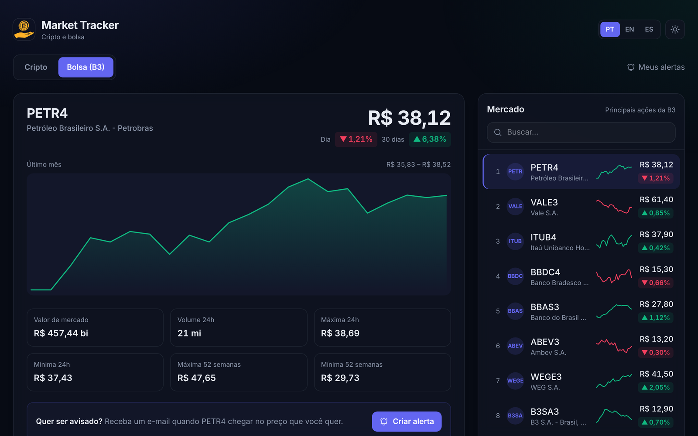
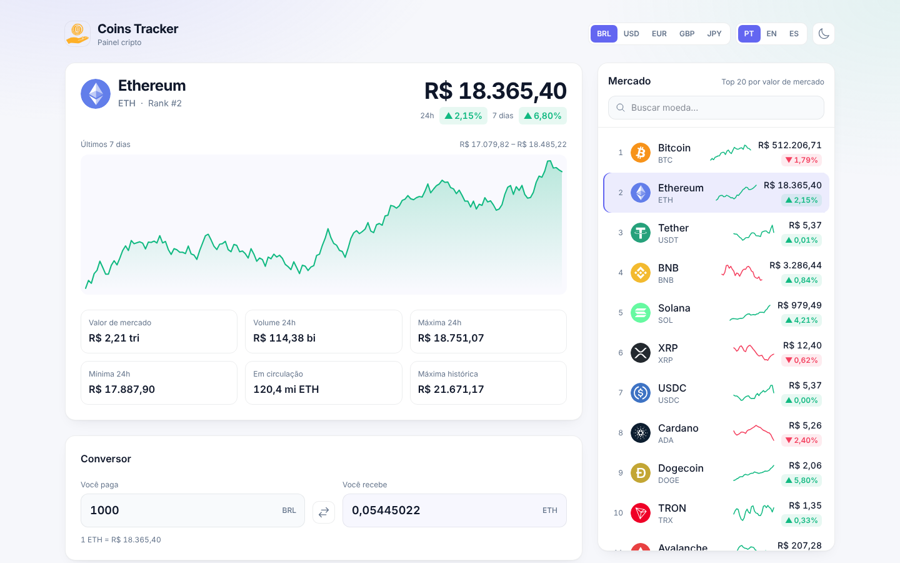
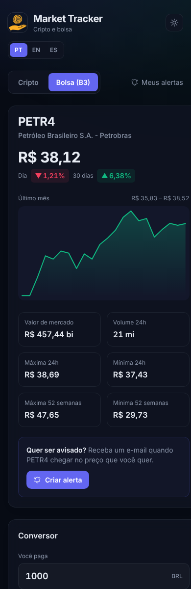

# Coins Tracker

[](https://github.com/wallaceluis/coins-tracker/actions/workflows/ci.yml)

Painel de criptomoedas com as 20 maiores moedas do mercado, gráfico dos últimos 7 dias e conversor, cotado em **BRL, USD, EUR, GBP ou JPY**. Os dados se atualizam sozinhos a cada minuto e o app funciona em português, inglês e espanhol, nos temas claro e escuro.

**Demo:** https://coins-tracker-taupe.vercel.app



<table>
  <tr>
    <td width="68%"></td>
    <td></td>
  </tr>
</table>

## Funcionalidades

- **Mercado ao vivo**: top 20 por valor de mercado, com minigráfico de 7 dias e variação de 24h, busca por nome ou símbolo.
- **Detalhe da moeda**: preço, variação de 24h e 7 dias, gráfico de 7 dias, valor de mercado, volume, máxima/mínima de 24h, oferta em circulação e máxima histórica.
- **Conversor nos dois sentidos**: quanto de cripto o seu dinheiro compra, ou quanto vale uma quantidade de cripto.
- **Atualização automática** a cada 60 segundos, pausada quando a aba está em segundo plano e retomada ao voltar.
- **Falhas tratadas**: se a API cair ou bater o limite de requisições, o app avisa, mantém os últimos dados na tela e oferece "tentar de novo".
- **Preferências salvas**: moeda, idioma, tema e moeda selecionada ficam guardados no navegador. O tema segue o sistema na primeira visita.
- **Acessível**: navegação por teclado, foco visível, `aria` nos controles e respeito a "reduzir movimento".

## Stack

| Camada     | Tecnologias                                                       |
| ---------- | ----------------------------------------------------------------- |
| Interface  | Vue 3 (Composition API, `<script setup>`), TypeScript, Tailwind CSS 4 |
| Estado     | Composables + VueUse (`useStorage`, `useDark`, `useDocumentVisibility`) |
| i18n       | Vue I18n (pt, en, es) com `Intl.NumberFormat` por idioma          |
| Gráficos   | SVG próprio, sem biblioteca de gráficos (~1 KB)                   |
| Dados      | [CoinGecko API](https://www.coingecko.com/en/api) (pública, sem chave) |
| Qualidade  | Vitest + Vue Test Utils, ESLint, vue-tsc, GitHub Actions          |
| Deploy     | Vercel (deploy automático a cada push no `main`)                  |

## Arquitetura

```
src/
├── services/coinGecko.ts     # única chamada HTTP (fetch + AbortController)
├── composables/useMarket.ts  # estado do mercado, seleção, auto-refresh
├── composables/useTheme.ts   # tema claro/escuro persistido
├── utils/                    # formatação (Intl), conversão, geometria do gráfico
├── components/               # TheHeader, MarketList, CoinDetail, CryptoConverter, SparkLine
└── views/HomeView.vue        # layout e estados de carregamento/erro
```

A CoinGecko já devolve os preços na moeda pedida (`vs_currency`), então não é preciso uma segunda API de câmbio. Trocar de moeda cancela a requisição anterior para que uma resposta atrasada não sobrescreva a nova.

## Como rodar

Requer Node.js 20 ou mais novo.

```bash
git clone https://github.com/wallaceluis/coins-tracker.git
cd coins-tracker
npm install
npm run dev
```

Não precisa de chave de API. Se quiser um limite de requisições maior, crie uma chave "Demo" gratuita na CoinGecko e coloque em `.env.local`:

```env
VITE_COINGECKO_API_KEY=sua_chave
```

### Scripts

| Comando              | O que faz                                  |
| -------------------- | ------------------------------------------ |
| `npm run dev`        | Servidor de desenvolvimento                |
| `npm test`           | Testes unitários (Vitest)                  |
| `npm run lint`       | ESLint                                     |
| `npm run type-check` | Checagem de tipos (vue-tsc)                |
| `npm run build`      | Checagem de tipos + build de produção      |

---

## English

Crypto dashboard showing the top 20 coins by market cap, a 7-day chart and a two-way converter, priced in BRL, USD, EUR, GBP or JPY. Data refreshes every minute (paused while the tab is hidden), and the UI is available in Portuguese, English and Spanish with light and dark themes.

Built with Vue 3, TypeScript, Tailwind CSS 4 and VueUse, on the public CoinGecko API (no key needed). Charts are hand-rolled SVG. Tested with Vitest and checked on every push by GitHub Actions; deployed on Vercel.

```bash
npm install && npm run dev
```
