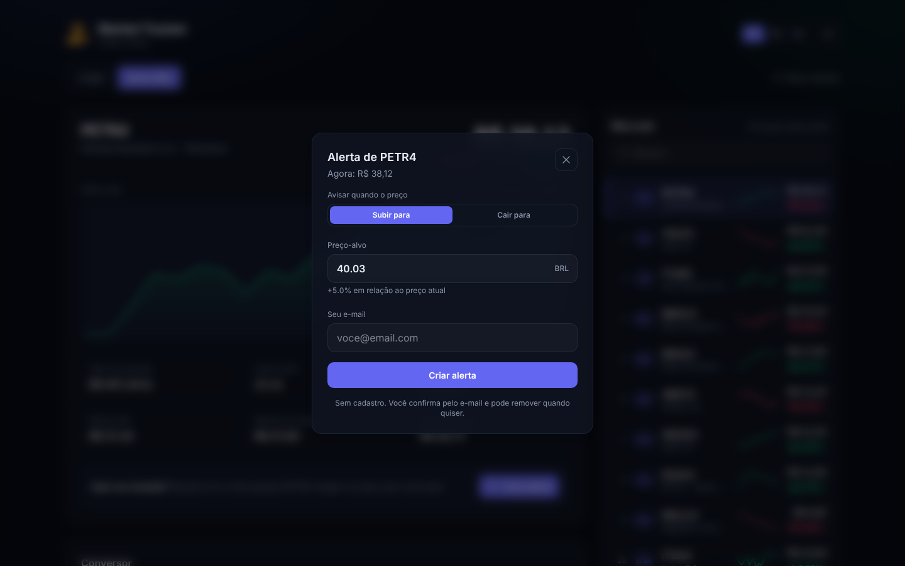
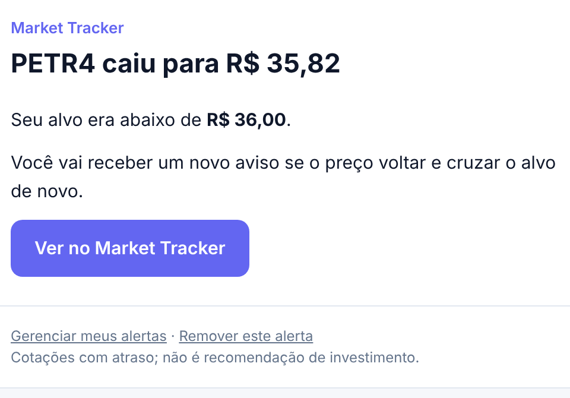
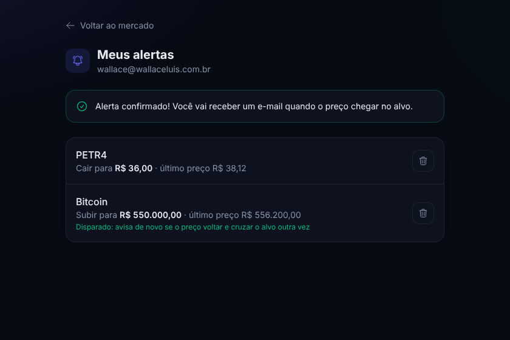
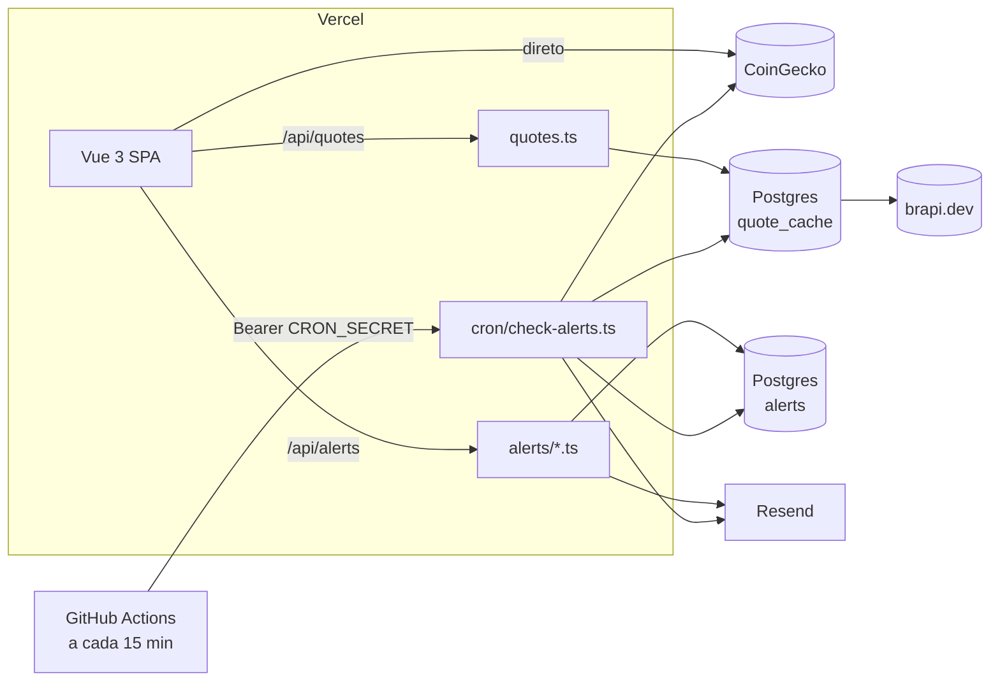

# Market Tracker

[](https://github.com/wallaceluis/coins-tracker/actions/workflows/ci.yml)
[](https://github.com/wallaceluis/coins-tracker/actions/workflows/alerts-cron.yml)

Painel de **criptomoedas e ações da B3** com gráficos, conversor e **alertas de preço por e-mail**. Qualquer pessoa pode criar um alerta sem cadastro: basta informar o e-mail e o preço-alvo, confirmar pelo link recebido e pronto.

**Demo:** https://coins-tracker-taupe.vercel.app


<table>
  <tr>
    <td width="50%"></td>
    <td width="50%"></td>
  </tr>
  <tr>
    <td></td>
    <td></td>
  </tr>
</table>

## Funcionalidades

- **Duas abas**:
  - **Cripto**: top 20 da CoinGecko, gráfico de 7 dias, cotação em BRL, USD, EUR, GBP ou JPY.
  - **Bolsa**: principais ações da B3 pela brapi.dev, com gráfico do último mês, máximas e mínimas do dia e de 52 semanas.
- **Alertas por e-mail** ("avise quando PETR4 cair para R$ 36"):
  - Sem cadastro, com confirmação por e-mail (double opt-in): ninguém consegue inscrever o e-mail de outra pessoa.
  - Dispara uma vez ao cruzar o alvo e só rearma quando o preço volta com folga de 0,5%, então não chega um e-mail a cada oscilação.
  - Página "Meus alertas" e link de remoção em todo e-mail, com descadastro de um clique (`List-Unsubscribe`) no Gmail e no Outlook.
  - Limites contra abuso: 10 alertas ativos por e-mail, 5 pedidos pendentes por hora e um campo honeypot.
- **Conversor nos dois sentidos**: quanto de cripto ou quantas ações o seu dinheiro compra, e o contrário.
- **Atualização automática**: a cada 60 s para cripto e 5 min para ações, pausada com a aba em segundo plano.
- **Interface**: 3 idiomas, tema claro/escuro que segue o sistema, acessível por teclado e responsiva.

## Arquitetura



- **Front**: Vue 3 (Composition API), TypeScript, Tailwind CSS 4, VueUse e gráficos em SVG próprio.
- **API**: funções serverless da Vercel na pasta `api/` (Web `Request`/`Response`). O token da brapi nunca vai para o navegador.
- **Banco**: Postgres via [`postgres`](https://github.com/porsager/postgres). O esquema é criado sozinho no primeiro acesso (`server/schema.ts`).
- **Cache de cotações da B3**: 15 min durante o pregão e 6 h fora dele, no Postgres e na CDN da Vercel, para caber no plano grátis da brapi.
- **Cron**: o GitHub Actions chama `/api/cron/check-alerts` a cada 15 min. Ações só são verificadas no horário do pregão.

```
api/                 rotas serverless (quotes, alerts, alerts/confirm|manage|unsubscribe, cron)
server/              lógica do backend: banco, cotações, regras dos alertas, e-mails
shared/              tipos usados pelo front e pelo back
src/                 app Vue (views, components, composables)
```

## Configuração (tudo no plano grátis)

1. **Banco**: no projeto da Vercel, vá em *Storage → Create Database → Neon (Postgres)* e conecte ao projeto. A Vercel cria a variável `DATABASE_URL` sozinha. Supabase também funciona; nesse caso use a URL do *connection pooler*.
2. **brapi**: crie uma conta em [brapi.dev](https://brapi.dev) e copie o token.
3. **Resend**: com o domínio já verificado, crie uma API key em *API Keys*.
4. **Variáveis na Vercel** (*Settings → Environment Variables*):

   | Variável         | Valor                                                     |
   | ---------------- | --------------------------------------------------------- |
   | `DATABASE_URL`   | criada pela integração do Neon                            |
   | `BRAPI_TOKEN`    | token da brapi                                            |
   | `RESEND_API_KEY` | chave do Resend                                           |
   | `ALERTS_FROM`    | `Market Tracker <alertas@wallaceluis.com.br>`             |
   | `APP_URL`        | `https://coins-tracker-taupe.vercel.app`                  |
   | `CRON_SECRET`    | um texto aleatório longo (ex.: `openssl rand -hex 32`)    |

5. **Secrets no GitHub** (*Settings → Secrets and variables → Actions*): `APP_URL` e `CRON_SECRET` com os mesmos valores.
6. Faça um novo deploy na Vercel e rode o workflow **Price alerts** manualmente uma vez (*Actions → Price alerts → Run workflow*) para conferir.

> O GitHub pausa workflows agendados em repositórios públicos sem nenhum commit há 60 dias; se isso acontecer, é só reativar em *Actions*. Para não depender disso, dá para apontar um serviço gratuito como o [cron-job.org](https://cron-job.org) para a mesma URL com o cabeçalho `Authorization`.

## Como rodar localmente

```bash
npm install
npm run dev          # só o front (a aba Bolsa e os alertas precisam da API)
npx vercel dev       # front + funções /api, lendo as variáveis de .env.local
```

Copie `.env.example` para `.env.local` e preencha o que for usar.

### Testes

| Comando              | O que faz                                                         |
| -------------------- | ----------------------------------------------------------------- |
| `npm test`           | Testes do front e do back (Vitest)                                |
| `npm run lint`       | ESLint                                                            |
| `npm run type-check` | vue-tsc no front e tsc no backend                                 |

Os testes de integração dos alertas rodam contra um **Postgres real**, com CoinGecko, brapi e Resend simulados. Eles cobrem criação, confirmação por link, disparo único, rearme, horário do pregão, cache de cotações, remoção, limites e autenticação do cron. Ficam desligados sem `TEST_DATABASE_URL`; o CI sobe um Postgres para eles:

```bash
TEST_DATABASE_URL=postgres://postgres@localhost:5432/market_test npm test
```

---

## English

Crypto **and Brazilian stock (B3)** dashboard with charts, a converter and **email price alerts**. Anyone can create an alert without signing up: enter an email and a target price, then confirm through the link (double opt-in). Alerts fire once when the target is crossed and re-arm with a 0.5% margin; every email has a one-click unsubscribe.

Vue 3 + TypeScript + Tailwind CSS on Vercel, with serverless functions for the brapi proxy, alert API and cron; Postgres (Neon/Supabase) for alerts and quote caching; Resend for email; GitHub Actions triggers the check every 15 minutes. Integration tests run against a real Postgres in CI.
